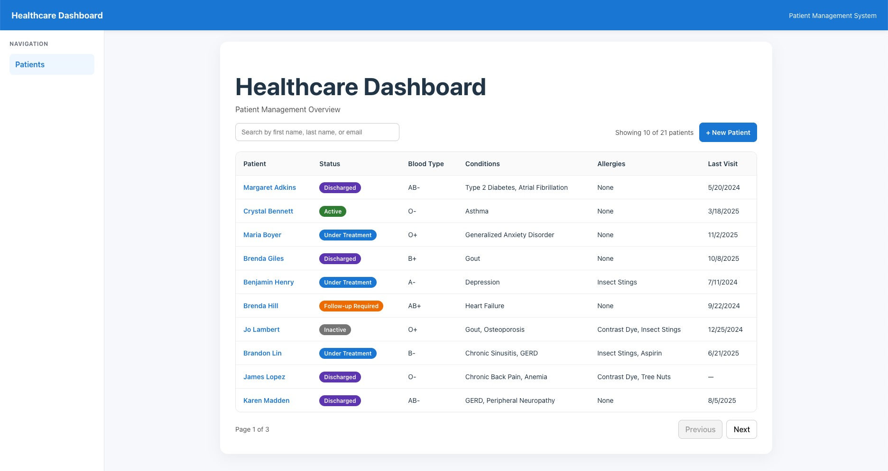
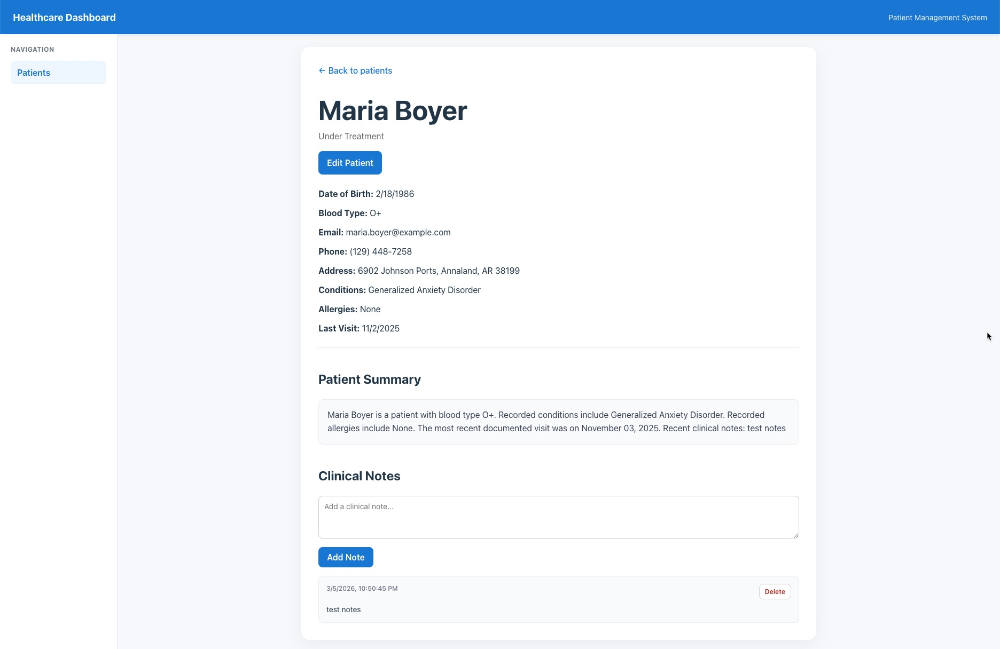
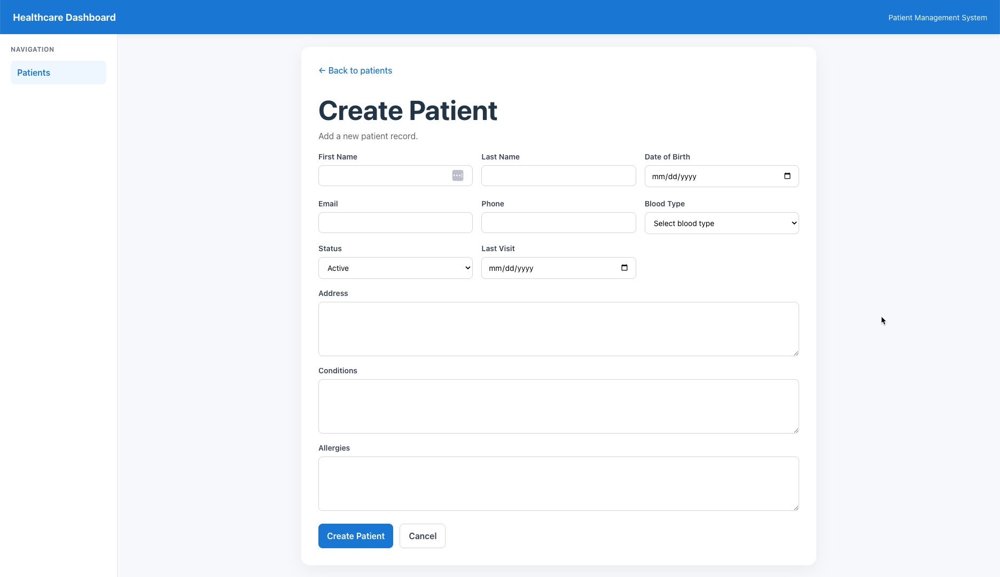
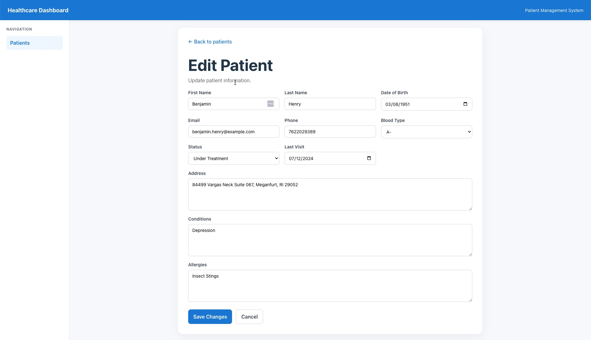

# Healthcare Dashboard

A full-stack healthcare patient management dashboard built with **FastAPI**, **PostgreSQL**, and **React + TypeScript**.

The application allows users to:

- View patient records
- Search and paginate large datasets
- View detailed patient profiles
- Add and delete clinical notes
- Generate patient summaries
- Create and edit patient records

The project demonstrates a maintainable full-stack architecture with a containerized backend and modern React frontend.

---

## UI Preview

### Patient Dashboard



### Patient Detail



### Create Patient



### Edit Patient



---

# Tech Stack

## Backend
- FastAPI
- PostgreSQL
- SQLAlchemy ORM
- Alembic (database migrations)
- Docker / Docker Compose

## Frontend
- React
- TypeScript
- Vite
- React Router

---

# Architecture Notes

- **Vite** was used for fast frontend setup and iteration speed.
- **FastAPI** provides a lightweight but production-ready API framework with automatic OpenAPI documentation.
- **PostgreSQL + Alembic** ensure the database schema can be recreated reliably across environments.
- The patient list API supports **pagination, searching, and sorting** to scale beyond trivial datasets.
- Clinical notes and patient summaries are implemented as **separate API resources** to keep the domain model modular.
- A lightweight **request logging middleware** improves backend observability during development.

---

# Features

## Backend API

- RESTful patient API
- Pagination, sorting, and search
- Clinical notes endpoints
- Generated patient summary endpoint
- Seeded realistic patient data
- Swagger/OpenAPI documentation
- Dockerized backend services
- Database migrations with Alembic
- API request logging middleware

## Frontend Dashboard

- Responsive patient table view
- Search functionality
- Pagination controls
- Patient detail view
- Clinical notes display
- Add/delete clinical notes
- Generated patient summary view
- Create patient form
- Edit patient form
- Routing with React Router
- API integration with FastAPI

---

# Project Structure

```
healthcare-dashboard
│
├── backend
│   ├── app
│   │   ├── main.py
│   │   ├── models.py
│   │   ├── schemas.py
│   │   ├── database.py
│   │   └── seed.py
│   │
│   ├── alembic
│   ├── Dockerfile
│   └── requirements.txt
│
├── frontend
│   ├── src
│   │   ├── App.tsx
│   │   ├── Layout.tsx
│   │   └── pages
│   │       ├── Patients.tsx
│   │       ├── PatientDetail.tsx
│   │       ├── PatientForm.tsx
│   │       └── NotFound.tsx
│   │
│   └── package.json
│
├── docker-compose.yml
├── README.md
│
├── dashboard.jpg
├── patient_details.jpg
├── create_patient.jpg
└── edit_patient.jpg
```

---

# Running the Project

## 1. Start Backend + Database

From the project root:

```
docker compose up --build
```

This starts:

- FastAPI backend API
- PostgreSQL database

API base URL:

```
http://localhost:8000
```

Swagger documentation:

```
http://localhost:8000/docs
```

---

## 2. Start the Frontend

Open a new terminal:

```
cd frontend
npm install
npm run dev
```

Frontend typically runs at:

```
http://localhost:5173
```

If that port is already in use, Vite may automatically select another local port such as:

```
http://localhost:5174
```

---

# API Endpoints

| Method | Endpoint | Description |
|------|------|------|
| GET | /patients | List patients with pagination |
| GET | /patients/{id} | Get patient by ID |
| POST | /patients | Create patient |
| PUT | /patients/{id} | Update patient |
| DELETE | /patients/{id} | Delete patient |
| GET | /patients/{id}/notes | List notes for a patient |
| POST | /patients/{id}/notes | Add a note |
| DELETE | /patients/{id}/notes/{note_id} | Delete a note |
| GET | /patients/{id}/summary | Generate patient summary |

---

# Query Parameters

The `GET /patients` endpoint supports:

| Parameter | Description |
|------|------|
| page | Page number |
| page_size | Records per page |
| q | Search by first name, last name, or email |
| sort | Sort field |
| order | asc / desc |

Example request:

```
/patients?page=1&page_size=10&q=john
```

---

# Seed Data

On application startup, the backend seeds the database with **20 realistic patient records**, including:

- medical conditions
- allergies
- blood types
- visit history
- patient statuses

The seeding process is **idempotent**, meaning it will not duplicate records if the database already contains data.

---

# Notes

- The backend runs inside **Docker containers** to provide reproducible local development.
- **Alembic migrations** allow the schema to be recreated from scratch.
- The frontend communicates with the backend using the **patients, notes, and summary endpoints**.
- **Request logging middleware** provides simple request timing and status logging for API calls.

---

# Future Improvements

Potential enhancements:

- Column sorting controls in the UI
- Advanced search filters
- Frontend containerization via Docker
- Environment-based API URL configuration
- Authentication and role-based access
- Confirmation dialogs for destructive actions
- Real-time updates for patient notes